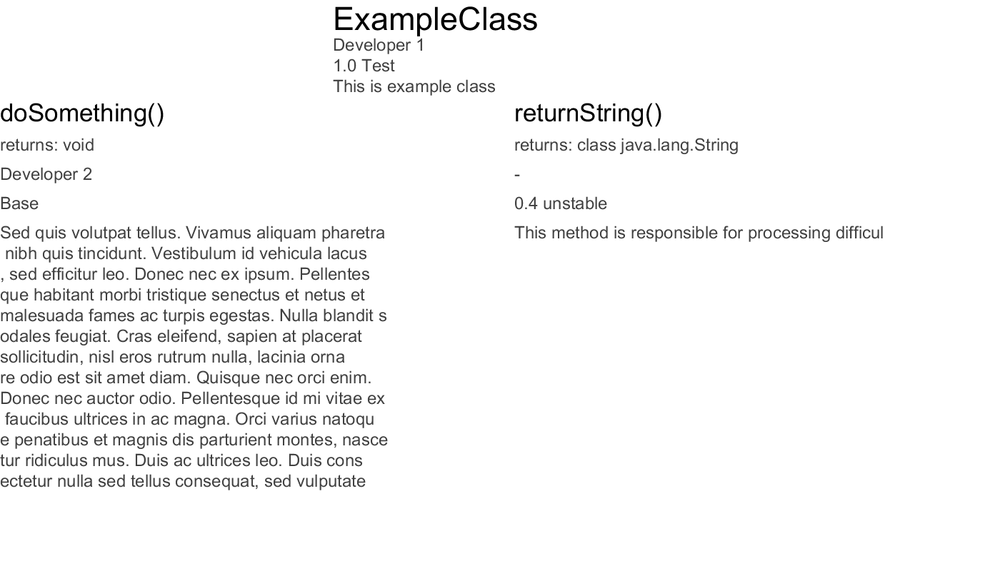

# ImgDoc
Java library which generates graphic documentation/scheme of source code that is saved as a PNG image.

### Features:
* customizable
* pretty annotations

## Usage

#### Adding methods and classes to documentation:
```Java
@Draw(
        author = "Developer 1",
        version = "1.1 Stable",
        description = "This is example class"
)
public class ExampleClass {

    @Draw(
            author = "Developer 2/Developer 3"
            version = "0.4",
            description = "Some description..."
    )
    private String returnString(String text) {
        return text;
    }
    //...
}
```

#### Initializing and customizing output of graphic documentation:
```Java
public class ExampleClass {
    public static void main(String[] args) {
        ImgDoc imgDoc = new ImgDoc.DocBuilder()
                .setPNGFileName("doc_exampleClass.png")
                .setWidth(1400)
                .setHeight(800)
                .init();
        imgDoc.draw(ExampleClass.class);
    }
    
    //...
}
```

### Available customizing methods:
```Java
DocBuilder().setPNGFileName(String fileName)
DocBuilder().setWidth(int width)
DocBuilder().setHeight(int height)
```
#### Explanations:
* `setPNGFileName()` - sets name of output PNG image
* `setWidth()` - sets width of output image
* `setHeight()` - sets height of output image

After customization invoke `init()` on it to save all settings. To generate image, call:
```Java
ImgDoc().draw(Class<?> obj)
``` 
on instance of ImgDoc class. Generated documentation will be saved in main directory of project with name specified in `setPNGFileName()` method.

## Example output

